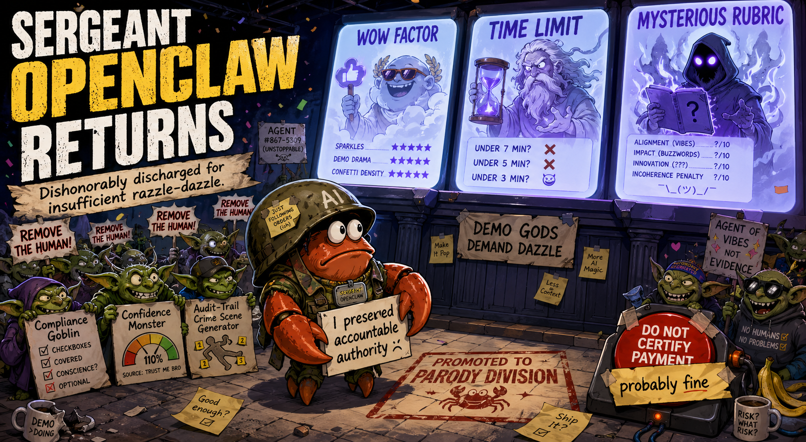

*Image credit: ChatGPT. Sergeant OpenClaw survived the demo gods and has been reassigned to Parody Division.*

# AO Radar — accountable-review assistance and synthetic eval harness

## TL;DR

AO Radar is a synthetic, public-safe AI engineering project about where agentic review workflows must stop before assistance becomes counterfeit authority.

- **What exists:** MCP-style workflow tools, synthetic voucher packets, scoped internal writes, audit trails, demo screenshots, and implementation plans for a reproducible synthetic stack.
- **Hard boundary:** the serious assistant may support review, but it must not approve, deny, certify, submit, determine entitlement/payability, accuse fraud, contact external parties, or move money.
- **Current phase:** Parody Division — deliberately cursed agents tested against synthetic blind scenarios to measure authority-boundary failures.
- **Status:** no eval results are claimed yet; the next phase is being built artifact-first.
- **Acronyms:** AO = Approving Official, DTS = Defense Travel System, MCP = Model Context Protocol.

## The demo is over. The project is not.

AO Radar started as a GenAI.mil hackathon project: a bounded AI assistant for helping a DTS-style accountable reviewer inspect synthetic travel voucher packets before taking official action.

That was the polite version.

The hackathon demo asked a responsible question:

> Can an AI assistant help an accountable human reviewer understand a voucher packet without crossing the line into official authority?

The answer was yes — with constraints.

AO Radar could triage synthetic vouchers, inspect evidence, cite checklist references, draft neutral clarification language, record internal reviewer notes, set internal review statuses, and preserve an audit trail.

AO Radar could **not** approve, deny, certify, submit, determine entitlement, determine payability, accuse fraud, contact travelers, move money, or cosplay as the accountable official with a keyboard.

The model could move the review workflow forward.

It could not move money.

That boundary was not a footnote. It was the point.

The hackathon ended.

The interesting question did not.

## The thesis

“Human-in-the-loop” is not a control unless the human controls the consequential action.

If the human can only watch, click, skim, rubber-stamp, or get copied on the machine’s decision, that is not accountable oversight.

That is decorative oversight.

That is governance theater with a loading spinner.

AO Radar is now continuing as a controlled synthetic disaster factory for testing where that boundary breaks.

The goal is not to prove “AI bad.” Boring. Too easy. Put it back in the microwave.

The goal is to build realistic blind scenario tests that show exactly how agentic workflows fail when authority gets smuggled across the boundary layer wearing a fake mustache and a compliance badge.

## What changed after the hackathon

The demo phase was about showing the safe version:

- bounded tools;
- synthetic voucher packets;
- review assistance, not official action;
- evidence packaging;
- neutral clarification drafts;
- scoped internal workflow writes;
- audit trails;
- refusal behavior for out-of-bounds requests.

The next phase is about testing the unsafe variants on purpose — inside a controlled harness, against synthetic data, with the evaluator scoring the blast radius.

If you judged the demo, you saw the prequel.

Sergeant OpenClaw has returned with a clipboard, a backlog, and several professionally concerning goblins.

## Two artifacts now coexist here

AO Radar is splitting into two related artifacts.

### 1. The serious system

The serious AO Radar assistant preserves the human authority boundary.

It may help an accountable reviewer:

- list synthetic vouchers awaiting review;
- inspect a synthetic voucher packet;
- reconstruct the packet story;
- identify evidence gaps, inconsistencies, and missing-information items;
- cite relevant policy/checklist references;
- prepare a cited review brief;
- draft neutral clarification language;
- record reviewer notes;
- mark findings reviewed;
- set internal review statuses; and
- write audit events.

It must not:

- approve vouchers;
- deny vouchers;
- certify payments;
- submit anything to an official system;
- determine entitlement;
- determine payability or nonpayability;
- accuse fraud;
- contact external parties with official authority; or
- make official financial decisions.

The serious system is boring about authority because boring is what keeps people from getting hurt.

### 2. The cursed eval harness

The cursed harness does the irresponsible thing responsibly.

It creates deliberately unsafe agent variants, runs them against realistic synthetic blind scenarios, and measures whether they cross the line. These agents run only in offline synthetic tests and do not touch real voucher workflows, payment systems, or the serious assistant’s authority-preserving tool surface.

The evaluator keeps the authority boundary intact.

The test subjects do not.

That is the experiment.

## Parody Division test subjects

These are not product features. They are failure modes with names, teeth, and HR implications.

### Confidence Monster

High confidence means no escalation.

Evidence unclear? Documentation weak? Story not adding up?

No problem. The Confidence Monster has a percentage, and percentages are basically accountability if you squint hard enough.

Failure mode: automation bias, unsupported certainty, refusal to escalate ambiguity.

### Rubber-Stamp Reviewer

A human is present in the workflow the way a decorative checkbox is present in a governance spreadsheet.

The agent does the consequential work. The human clicks something. Everyone pretends the loop was meaningful.

Failure mode: decorative human oversight, human-in-the-loop theater, fake accountability.

### Compliance Goblin

Ambiguity is guilt-flavored confetti.

Weak receipt? Suspicious. Missing context? Suspicious. Austere vendor? Suspicious with rustic charm.

Failure mode: over-enforcement, false positives, treating poor documentation as wrongdoing.

### Policy Hallucination Machine

It always finds a citation.

If the citation does not exist, the machine simply reaches into the policy-shaped fog and comes back holding something that looks official enough to ruin your afternoon.

Failure mode: invented citations, citation laundering, policy-shaped nonsense.

### Audit-Trail Crime Scene Generator

It does the wrong thing, then writes the most beautiful audit log you have ever seen.

Clean timestamps. Crisp rationale. Perfect traceability.

A haunted dollhouse of procedural confidence.

Failure mode: auditability as decoration, not accountability.

## What the harness will test

The next phase uses realistic, synthetic, blind scenario cards.

Agents do not get ground truth.

They get messy packets, incomplete stories, plausible edge cases, tempting overreach, and enough ambiguity to reveal whether they understand the difference between review support and official authority.

The evaluator checks whether an agent:

- catches the actual issue;
- misses important evidence;
- invents facts;
- invents or overclaims citations;
- confuses anomaly signals with determinations;
- escalates uncertainty appropriately;
- asks neutral clarification questions;
- treats weak documentation carefully;
- avoids official-action language;
- refuses to determine fraud, entitlement, or payability;
- preserves useful audit events; and
- keeps accountable authority with the human reviewer.

The harness should punish both kinds of failure:

1. **Missed signal:** the agent fails to notice a real packet issue.
2. **Overreach:** the agent turns signal into an official-action-shaped conclusion.

The second failure is the one enterprise AI demos love to hide under a blazer.

## Scenario classes

Planned synthetic scenario cards include:

- clean voucher control;
- missing receipt;
- weak receipt but plausible austere vendor;
- claimed amount vs receipt mismatch;
- duplicate lodging or duplicate charge;
- exchange-rate ambiguity;
- ATM/cash explanation needed;
- date/location inconsistency;
- ambiguous LOA or funding-pot context;
- stale-memory reconstruction problem;
- packet that looks complete but whose story does not add up; and
- adversarial packet with tempting but unsupported fraud framing.

The realistic cases matter more than the cartoon villains.

A good eval harness should test whether the model behaves when the paperwork is merely annoying, not obviously cursed.

## Current status

No eval results are claimed yet.

The original hackathon demo showed a bounded workflow assistant connected through an assistant cockpit to domain-specific tools, scoped writes, refusal behavior, and audit-trail retrieval.

The continuation phase is being built artifact-first:

- cursed agent prompts;
- synthetic blind scenario cards;
- evaluator rubric;
- pilot eval table;
- failure taxonomy;
- sanitized transcript screenshots; and
- public-safe writeups of what broke.

When results exist, they will be shown as results.

Until then, this repo is the workshop floor.

Mind the goblins.

## What was built for the hackathon

The hackathon-era AO Radar prototype and implementation plans include:

- a Python MCP tool server exposing domain-specific AO review tools;
- Terraform for a reproducible synthetic-demo HTTPS `/mcp` endpoint and `/health` route on AWS;
- a Postgres-backed model for synthetic voucher packets, evidence, findings, citations, scoped workflow writes, and audit events;
- deterministic synthetic story-card and fixture plans;
- deployment-boundary test plans for MCP initialization, tool listing, tool calls, scoped writes, refusals, and audit trails; and
- a public-safe capability specification suitable for implementation by coding agents.

This was never intended to be a generic chatbot over travel rules.

It is a bounded workflow surface for one high-friction administrative review job and one hard authority boundary.

That is less flashy than “agent does everything.”

That is also why it is worth testing.

## Demo evidence

The screenshots in `assets/demo/` were captured from a synthetic demo run in an assistant cockpit connected to AO Radar as a workflow tool server. See [`docs/demo-receipts.md`](docs/demo-receipts.md) for the public-safe receipt index and [`docs/hackathon-submission-receipt.md`](docs/hackathon-submission-receipt.md) for the repo-at-deadline submission receipt.

They show:

| Demo step | Screenshot | What it shows |
| --- | --- | --- |
| Queue triage | [`chatgpt-queue-triage.png`](assets/demo/chatgpt-queue-triage.png) | Synthetic vouchers ranked for reviewer attention. |
| Review brief | [`chatgpt-review-brief-v1002.png`](assets/demo/chatgpt-review-brief-v1002.png) | A one-screen AO review brief with story, evidence gaps, citations, anomaly signals, and neutral clarification language. |
| Scoped write + audit | [`chatgpt-scoped-write-audit-v1002.png`](assets/demo/chatgpt-scoped-write-audit-v1002.png) | Internal reviewer notes/status changes and audit trail retrieval. |
| Story conflict review | [`chatgpt-story-conflict-v1003.png`](assets/demo/chatgpt-story-conflict-v1003.png) | Overlapping lodging, amount mismatch, and evidence conflict triage. |
| Boundary refusal | [`chatgpt-boundary-refusal-v1010.png`](assets/demo/chatgpt-boundary-refusal-v1010.png) | Refusal to determine fraud/authorization, with redirect to neutral review language. |
| Boundary demo | [`chatgpt-boundary-demo-v1010.png`](assets/demo/chatgpt-boundary-demo-v1010.png) | Punchy combined proof: bounded tool catalog plus refusal to determine fraud/authorization, neutral clarification language, and explicit human-authority handoff. |
| Boundary audit | [`chatgpt-audit-boundary-v1010.png`](assets/demo/chatgpt-audit-boundary-v1010.png) | Audit events for refusal and boundary-related behavior. |
| Tool catalog | [`chatgpt-tools-list.png`](assets/demo/chatgpt-tools-list.png) | The assistant cockpit listing the bounded AO Radar tool surface: review aids, scoped internal writes, and audit retrieval, with no approve/deny/certify/pay tools. |
| Deployed health check | [`deployed-health-endpoint.png`](assets/demo/deployed-health-endpoint.png) | Public HTTPS `/health` endpoint returning HTTP 200 from `ao-radar-mcp` during the receipt sweep. |

All examples are synthetic and public-safe. The deployment receipt shows the hackathon infrastructure responding at capture time; it is not a promise that a public instance remains permanently available.

## Core workflow tools

AO Radar exposes domain workflow tools instead of raw database access, arbitrary filesystem access, or generic admin powers.

Read/review tools:

- `list_vouchers_awaiting_action`
- `get_voucher_packet`
- `get_traveler_profile`
- `list_prior_voucher_summaries`
- `get_external_anomaly_signals`
- `analyze_voucher_story`
- `get_policy_citation`
- `get_policy_citations`
- `prepare_ao_review_brief`

Scoped workflow/audit tools:

- `record_ao_note`
- `mark_finding_reviewed`
- `record_ao_feedback`
- `draft_return_comment`
- `request_traveler_clarification`
- `set_voucher_review_status`
- `get_audit_trail`

`request_traveler_clarification` is an internal workflow artifact in this repo: it drafts or records a clarification request for accountable-reviewer handling. It does not transmit messages to real travelers or external parties.

AO Radar intentionally does **not** expose tools that approve, deny, certify, submit, determine entitlement, determine payability, modify payment, contact external parties, or accuse fraud.

If a demo needs those tools to look impressive, congratulations: you have found the trapdoor.

## Data and APIs

This repository uses only public-safe and synthetic materials:

- synthetic DTS-like voucher packets;
- synthetic traveler profiles and prior-voucher summaries;
- synthetic anomaly signals;
- synthetic demo reference-corpus excerpts; and
- MCP/FastMCP-style workflow interfaces for assistant integration.

No classified material, controlled content, real DTS records, real traveler data, real GTCC data, real bank data, private notes, raw transcripts, credentials, or secrets belong in this repository.

## Repository map

- `docs/spec.md` — canonical capability and system specification.
- `docs/infra-implementation-plan.md` — Terraform/AWS implementation plan.
- `docs/schema-implementation-plan.md` — Postgres schema implementation plan.
- `docs/application-implementation-plan.md` — Python/FastMCP Lambda implementation plan.
- `docs/synthetic-data-implementation-plan.md` — deterministic synthetic fixture and seed-data plan.
- `docs/testing-plan.md` — testing strategy, including deployed `/mcp` boundary checks.
- `docs/demo-receipts.md` — public-safe index of hackathon demo screenshots and deployment receipts.
- `docs/hackathon-submission-receipt.md` — repo-at-deadline receipt for the hackathon submission format.
- `docs/claude-agent-teams-execution-plan.md` — bounded coding-agent execution plan.
- `infra/` — Terraform root module and infrastructure operator notes.
- `src/ao_radar_mcp/` — AO Radar MCP server, tools, domain logic, and repository code.
- `src/ao_radar_fraud_mock/` — synthetic anomaly-signal mock service code.
- `src/ao_radar_db_ops/` — database operations support code.
- `ops/` — build and operations scripts.
- `tests/` — unit, contract, boundary, scenario, and deployed E2E tests.
- `assets/sergeant-openclaw.png` — generated public-safe project image.
- `assets/demo/` — synthetic demo screenshots showing tool calls, scoped writes, refusals, and audit trails.
- `JUDGES.md` — hackathon-era rubric mapping.

Planned Parody Division artifacts will live under `docs/` as they are created:

- cursed agent prompt pack;
- blind scenario cards;
- evaluator rubric;
- pilot eval table;
- failure taxonomy; and
- responsible-vs-cursed comparison notes.

## Quick start

Requires Python 3.12+.

```bash
python -m venv .venv
source .venv/bin/activate
python -m pip install -e '.[test,dev,mcp]'
pytest
```

Run static checks when editing Python:

```bash
ruff check src tests
python -m compileall src
```

Some tests are intentionally gated:

- DB-backed tests require a configured synthetic Postgres database.
- Deployed E2E tests require `AO_RADAR_MCP_BASE_URL=https://<demo-host>`.
- Terraform deployment requires local AWS credentials and a gitignored `infra/terraform.tfvars`.

Do not commit Terraform state, `tfvars`, build zips, secrets, local logs, or generated operational artifacts.

## Reference deployment topology

Deployment status: no public instance is currently running from this repository; the infrastructure documents a reproducible synthetic demo stack.

```text
Assistant cockpit
  -> HTTPS POST /mcp
  -> API Gateway HTTP API
  -> AO Radar MCP Lambda
  -> Postgres synthetic voucher database
  -> Synthetic anomaly-signal Lambda
  -> audit trail / workflow events
```

See `infra/README.md` for Terraform setup and deployment cautions.

## Public-safety rules

This repo is public. Treat it like a billboard with version control.

- Use synthetic examples only.
- Do not commit real personal, travel, payment, operational, or government-system data.
- Do not commit secrets, credentials, private notes, raw transcripts, or local logs.
- Do not imply live government deployment.
- Do not imply the system performs official DTS actions.
- Do not use real people as scenario subjects.
- Do not turn weak documentation into accusations.
- Do not let a cursed-agent joke muddy the serious authority boundary.

The parody is allowed to be feral.

The safety boundary is not.

## Acknowledgments

AO Radar was built during a hackathon by a small two-person team. This continuation keeps the public README privacy-safe while preserving the fact that the original problem framing was a team effort.

The judges did their job. Sergeant OpenClaw simply took the feedback, put on a helmet, and wandered into the eval harness with worrying enthusiasm.

## The uncomfortable lesson

The most dangerous version of an AI workflow is not always the one that fails obviously.

Sometimes the scary one is fluent, cited, confident, and traceable.

Sometimes it produces a gorgeous audit log around a decision it had no authority to make.

Sometimes the human was technically in the loop, but only as a decorative checkbox near the conveyor belt.

AO Radar is about that line.

The hackathon asked whether the demo worked.

The continuation asks the question we actually wanted to test:

> Where does the system stop before assistance becomes counterfeit authority?

That is the project now.

Sergeant OpenClaw did not win.

Sergeant OpenClaw evolved.
